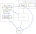

**Note: This WTip has been implemented for current implementation look at https://docs.windingtree.com.**

---

# Winding Tree Platform for Airlines - Proof of Concept proposal

## Simple Summary

A proposal for generalization of the Winding Tree platform so that it can
accommodate not just hotels but also airlines.

## Abstract

Current Winding Tree infrastructure does not allow other travel
services besides accommodation. In this document, we propose to
modify the Winding Tree data structure, smart contracts and the
surrounding ecosystem to enable the data distribution and basic
processes related to airlines. The proposed solution aims to
serve as a minimal proof-of-concept base for validation and
further research.

## Motivation

Allow airlines to offer flights on the Winding Tree platform.

## Specification

### Overview

The proposed solution is supposed to be a simple proof of
concept; a functional stepping stone that can be created with
minimal effort, but one that can be significantly extended in
the future.

With this in mind, we have decided to utilize as much from our
existing hotel infrastructure as possible, making working with
airlines very similar to working with hotels.

### Architecture

Just like in case of hotels, we envision the airline platform having
the following components:

- *WT Airline Index* - an Ethereum smart contract covering all the
airlines in the platform; equivalent to WT Hotel Index.
Individual airlines would then be represented by individual
Airline smart contracts reachable from the index, again,
similarly to the case of hotels. All other data would be
available off-chain based on references from the airline smart
contracts.

- *Decentralized off-chain storage* - Actual airline data should
be available off-chain in a decentralized manner, using
pre-agreed standard mechanisms, such as HTTP, Swarm or even NDC.

- *Convenience tools* - To make the platform usable, we would
like to extend support of the existing tools for airlines. This
includes at least:

    - wt-js-libs
    - wt-read-api
    - wt-notification-api
    - wt-booking-api

The architecture can be illustrated from various viewpoints
using the following informal diagrams.

#### Overview

In the first picture, the general overview is shown. Blue arrows
denote data flow; green arrows denote references (the same holds
in consequent diagrams as well). It shows that data suppliers
would push data in two principal ways - to the Ethereum
blockchain (i.e., register the airline on the WT airline index)
and to off-chain storages (more about them later). Data
consumers would then read from both.

#### Data structure

The second picture shows how the data structure itself is
composed in terms of documents. We can see that the on-chain
storage only holds a reference to the data root document, which
in turn holds references to other sub-documents.

#### Example integration

Finally, we can have a look at an example of how the actual
integration can be done in practical terms:

1. A once-off script is used to create an entry in the WT
   airline index and upload the root data document to swarm, as
   well as any static data.

2. Dynamic data, such as current flight availability
   information, is served dynamically by an API that conforms
   to the WT data structure. This API will probably be
   integrated with some internal systems of the airline in
   question.

3. A potential data consumer discovers the airline data
    root on the WT Airline index. All the actual
    information can then be retrieved by following the
    references.

#### Booking

Initially, booking will work just like it does in case of
hotels:

- The airline provides a booking service conforming to the
agreed interface.
- The airline data root points to the service address.
- Consumers can send their booking requests there.
- The airline responds with a booking reference and
a "finalization URL" where the booking process can be finalized
(e.g. by paying for the tickets).

The interface of the booking service is [here](https://github.com/windingtree/wt-booking-api/blob/master/docs/swagger.yaml).
([Earlier proposal](../assets/wtip-003/airlines-booking-swagger.yaml).)

### Data structure

The data structure is formally described [here](https://github.com/windingtree/wiki/blob/master/airline-data-swagger.yaml),
using the OpenAPI notation.
([Earlier proposal](../assets/wtip-003/airlines-data-swagger.yaml).)

### Implementation details

#### WT Read API

In case of [wt-read-api](https://github.com/windingtree/wt-read-api)
we will simply add new endpoints handling airlines, next to the
existing endpoints for hotels.

#### WT Notification API

[wt-notification-api](https://github.com/windingtree/wt-notification-api)

Update scopes need to be extended in the update notification
data structure, nothing more.

#### WT Booking API

[wt-booking-api](https://github.com/windingtree/wt-booking-api)

We will create a reference implementation of the proposed
airline booking interface (similarly to the current
wt-booking-api in case of hotels).

#### NDC Compatibility

From the point of view of the WT Platform, [NDC](https://www.iata.org/whatwedo/airline-distribution/ndc/Pages/default.aspx)-compatible
APIs can be viewed as off-chain storages to read from (and
possibly even to write to). Therefore, we will probably develop
an NDC off-chain adapter, similar to (if somewhat more complex
than) the existing swarm and http adapters. To this end, we
might base the work on the [NDC adapter](https://github.com/afklblockchain)
developed by the AFKL team in the WindingTree hackathon.

## Rationale

### Why not make this fully NDC-Based?

Several people have proposed a competing vision of the WT Airline
platform where instead of documents, the entries in the WT
Airline Index point to NDC-compatible APIs. The platform is then
basically reduced to a public registry of standardized APIs.

Such an approach has one major advantage - it builds on an
existing standard (IATA's NDC) and requires very little
additional work from the airlines. So why did we choose
a different route? There are several reasons:

- It is not clear what value would this approach bring compared
to what exists already (e.g. the [IATA NDC Registry](https://www.iata.org/whatwedo/airline-distribution/ndc/Pages/registry.aspx)).
- NDC implies using authentication / authorization of parties
(called "Sellers" or "Aggregators") to limit access to the API.
This goes directly against Winding Tree's goal of enabling
"permissionless innovation" by opening the data to anyone.
- The mission of Winding Tree is to develop a set of open
protocols and open-source tools. However, the NDC standard
specification itself is not open as it is covered by a license
that does not allow free redistribution.

## Copyright
Copyright and related rights waived via [CC0](https://creativecommons.org/publicdomain/zero/1.0/).
